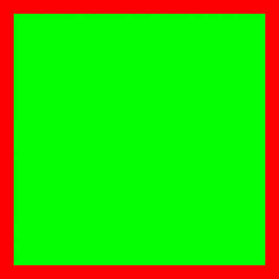

<h2>ADJUST (JOV) 🕸️</h2>
<h3>JOVIMETRIX 🔺🟩🔵/ADJUST</h3>

Blur, Sharpen, Emboss, apply Levels, HSV adjustments, or detect Edges.

[ADJUST WORKFLOW EXAMPLE](ADJUST.json)

help system powered by [MelMass](https://github.com/melMass) and the [comfy_mtb](https://github.com/melMass/comfy_mtb) project
