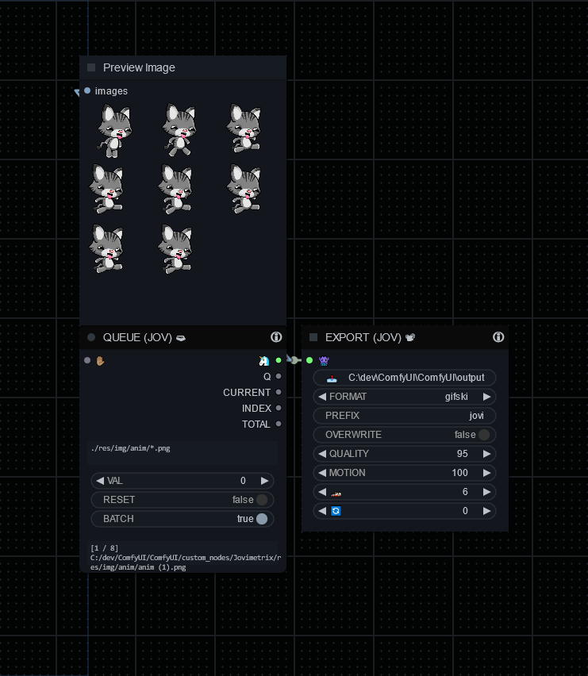

# EXPORT (JOV) 📽

## JOVIMETRIX 🔺🟩🔵/UTILITY

The Export node is responsible for saving images or animations to disk. It supports various output formats such as GIF and GIFSKI. Users can specify the output directory, filename prefix, image quality, frame rate, and other parameters. Additionally, it allows overwriting existing files or generating unique filenames to avoid conflicts. The node outputs the saved images or animation as a tensor.

#### OUTPUT NODE?: `True`

### INPUT

NONE

### OUTPUT

NONE

help powered by [MelMass](https://github.com/melMass) & [comfy_mtb](https://github.com/melMass/comfy_mtb) project