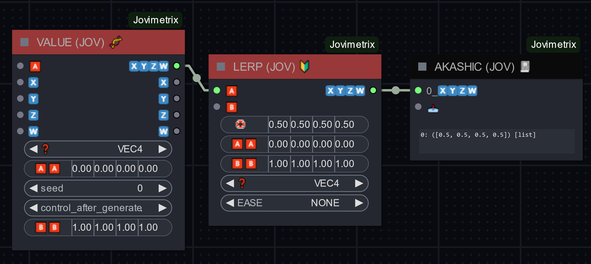

# LERP (JOV) 🔰

## JOVIMETRIX 🔺🟩🔵/CALC

The Lerp Node performs linear interpolation between two values or vectors based on a blending factor. It supports easing functions for smoother transitions and outputs the result as either floats or integers.

#### OUTPUT NODE?: `False`

### INPUT

#### OPTIONAL

name | type | desc | default | meta
:---:|:---:|---|:---:|---
🅰️ | * | input a |  | 
🅱️ | * | input b |  | 
🛟 | FLOAT | linear | 0.0 | 
EASE | STRING | easing function | NONE | NONE, QUAD IN, QUAD OUT, QUAD IN OUT, CUBIC IN, CUBIC OUT, CUBIC IN OUT, QUARTIC IN, QUARTIC OUT, QUARTIC IN OUT, QUINTIC IN, QUINTIC OUT, QUINTIC IN OUT, SIN IN, SIN OUT, SIN IN OUT, CIRCULAR IN, CIRCULAR OUT, CIRCULAR IN OUT, EXPONENTIAL IN, EXPONENTIAL OUT, EXPONENTIAL IN OUT, ELASTIC IN, ELASTIC OUT, ELASTIC IN OUT, BACK IN, BACK OUT, BACK IN OUT, BOUNCE IN, BOUNCE OUT, BOUNCE IN OUT
❓ | STRING | type | FLOAT | INT, FLOAT

### OUTPUT

name | type | desc
:---:|:---:|---
🔮 | * | Any Type 

help powered by [MelMass](https://github.com/melMass) & [comfy_mtb](https://github.com/melMass/comfy_mtb) project