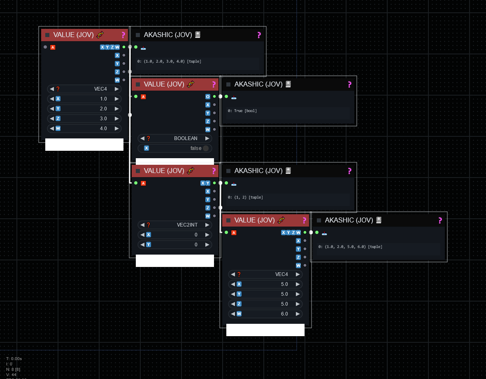

# VALUE (JOV) 🧬

## JOVIMETRIX 🔺🟩🔵/CALC

The Value Node supplies raw or default values for various data types, supporting vector input with components for X, Y, Z, and W. It also provides a string input option.

#### OUTPUT NODE?: `False`

### INPUT

#### OPTIONAL

name | type | desc | default | meta
:---:|:---:|---|:---:|---
🅰️ | * | input a |  | 
❓ | STRING | type | BOOLEAN | BOOLEAN, FLOAT, INT, VEC2, VEC2INT, VEC3, VEC3INT, VEC4, VEC4INT, STRING, LIST, DICT, COORD2D, ANY, MASK
🇽 | FLOAT | x | 0 | 
🇾 | FLOAT | y | 0 | 
🇿 | FLOAT | z | 0 | 
🇼 | FLOAT | width | 0 | 
📝 | STRING | string entry |  | 

### OUTPUT

name | type | desc
:---:|:---:|---
🔮 | * | Any Type 
🇽 | * | X 
🇾 | * | Y 
🇿 | * | Z 
🇼 | * | Width 

help powered by [MelMass](https://github.com/melMass) & [comfy_mtb](https://github.com/melMass/comfy_mtb) project